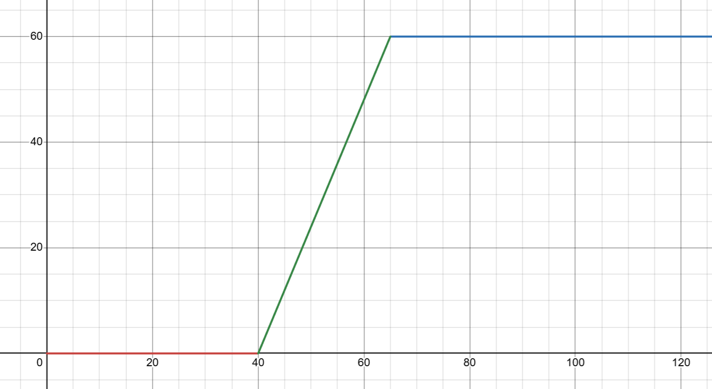

# idrac_fan_control
This python/docker library is used for iDRAC and IPMI servers to control their fan speed based on CPU Temperatures

## Fan Speed Calculation

For this package you can set a start temperature (`START_TEMP`) and end temperature (`END_TEMP`). When the system is below the `START_TEMP` then the `START_FAN` speed is applied to all fans. If you temperature is equal or above the `END_TEMP` then the `END_FAN` speed is applied to all fans.

Between these two points a linear gradient is used. The below graph shows how the fan speed changes with CPU temperature. The `x` axis is the temperature of the CPU and the `y` axis is the fan speed.



You should optimise these values in line with your CPU and other hardware specifications.

## Docker Compose

```yaml
services:
  idrac-fan-control:
    image: ghcr.io/benclark158/idrac_fan_control:latest
    container_name: idrac_fan_control
    restart: unless-stopped
    environment:
      - IPMI_HOST=<192.168.0.120> # also accepts DNS names
      - IPMI_USER=<root>
      - IPMI_PWD=<calvin>
      - START_TEMP=<40> # CPU temp in C
      - START_FAN=<0> # Fan speed in %
      - END_TEMP=<65> # CPU Temp in C
      - END_FAN=<60> # Fan speed in %
      - INTERVAL=<30> # default interval between checks in seconds
      - GET_CPU_UTIL=<true|false> # Should the CPU utilisation be output in the termal - this slows the loop - default False
```

### Setup

You need to enable IPMI over the network for this container to work correctly.

## Support

This extension has only been tested on Dell servers (specifically Dell R730xd), the functionality may be different for other brands or newer versions of IPMI/iDRAC.